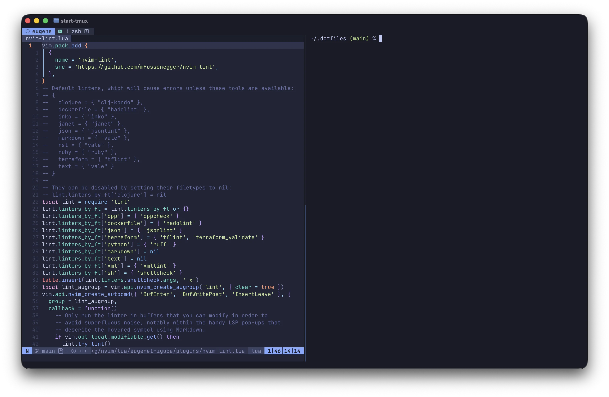

# Dotfiles

Configuration files and scripts for my personal systems.



## Structure

The repository uses [GNU Stow](https://www.gnu.org/software/stow/) to manage
symlinks between these configuration files and the user's home directory.
Homebrew packages are tracked via a Brewfile.

## Installation

Clone the repository and run the installation script:

```sh
git clone git@github.com:eugenetriguba/dotfiles.git ~/.dotfiles
cd ~/.dotfiles
chmod u+x install.sh
./install.sh
```

💡 Note: The repository is intended to be cloned into a top-level directory in
the `$HOME` directory because GNU Stow defaults to using the parent directory
for it's symlinking. If cloned elsewhere, the `stow` commands in `install.sh`
would need to be updated.

