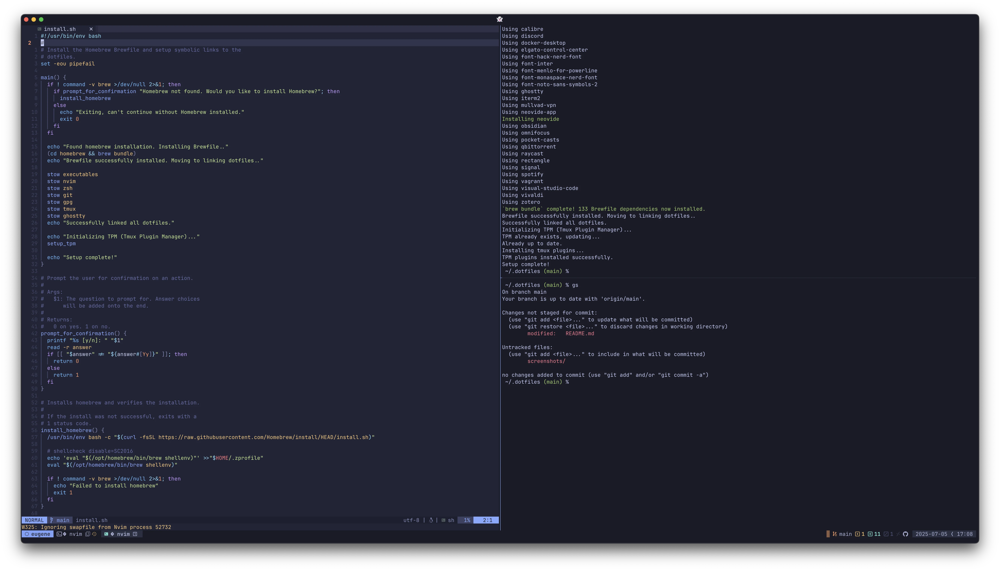

# Dotfiles

Configuration files and scripts for my macOS development environment.



## What's Included

- Terminal: GhostTY
- Shell: Zsh
- Editor: Neovim
- Multiplexer: Tmux with TPM for plugin management
- Git & GPG configurations
- Custom scripts, such as `gh-clone-all`, which makes it easy to clone GitHub
  repositories and keep them up to date in bulk.

## Structure

The repository uses [GNU Stow](https://www.gnu.org/software/stow/) to manage
symlinks between these configuration files and the user's home directory.
Homebrew packages are tracked via a Brewfile.

## Installation

Clone the repository and run the installation script:

```sh
git clone git@github.com:eugenetriguba/dotfiles.git ~/.dotfiles
cd ~/.dotfiles
chmod u+x install.sh
./install.sh
```

💡 Note: The repository is intended to be cloned into a top-level directory in
the `$HOME` directory because GNU Stow defaults to using the parent directory
for it's symlinking. If cloned elsewhere, the `stow` commands in `install.sh`
would need to be updated.

## Homebrew Management

To update your `homebrew/Brewfile` with your currently installed Homebrew
formulae and casks, run:

```sh
chmod u+x homebrew/sync-brewfile.sh
./homebrew/sync-brewfile.sh
```

This script only updates the `homebrew/Brewfile` with your current manually
installed Homebrew packages. It does not install or remove any packages.
You can then use `git diff` to review the changes.

